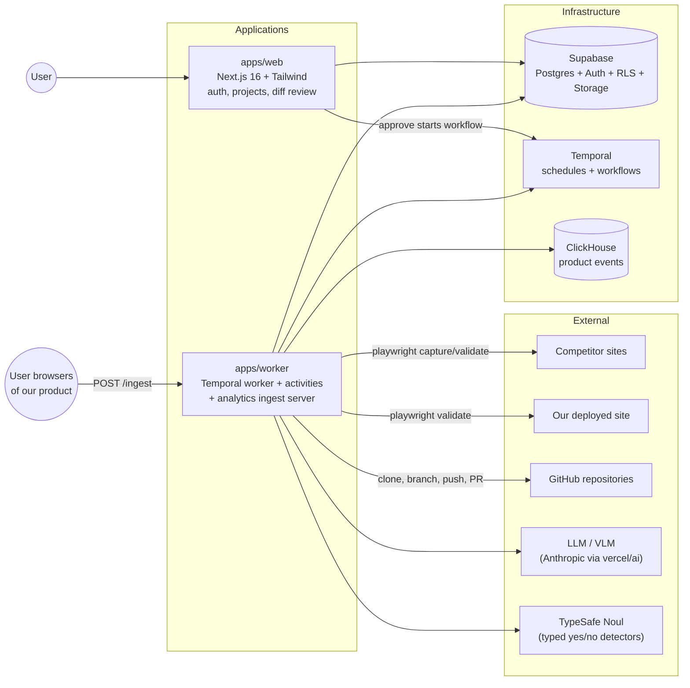

# Architecture

Copycat is a competitive visual intelligence system. It watches competitor pages and product analytics, converts deltas into reviewable change proposals ("diffs"), and lets a human approve them before a coding agent implements, validates and (when the remote allows it) opens a pull request.

## System diagram

## Components and responsibilities

| Component | Responsibility | Deterministic? |
| --- | --- | --- |
| `apps/web` (Next.js) | Auth (Supabase magic link), project + competitor registration, Change Intelligence UI, approve/deny actions, starts `diffImplementationWorkflow` | Yes |
| `apps/worker` (Temporal worker) | Executes cron schedules and all workflows; owns every side effect | Mixed |
| `snapshotScanWorkflow` | Daily competitor scan: capture DOM, hash, LLM dom-diff, Noul visual gate, screenshots, create diffs | Mixed |
| `analyticsScanWorkflow` | Monthly: query ClickHouse, deterministic metric deltas, LLM statements, Noul filter, create diffs | Mixed |
| `diffImplementationWorkflow` | Plan → implement → review → push/PR → browser validation → status | Mixed |
| Temporal | Durable orchestration, cron schedules, retries, per-project serialization | n/a |
| Supabase Postgres | Projects, competitors, snapshots, screenshots metadata, diffs, RLS | Yes |
| Supabase Storage | Public-read `screenshots` bucket (evidence) | Yes |
| ClickHouse | Product events (`copycat.events`) and monthly aggregation | Yes |
| Claude Agent SDK | Coding agent: plan, implement, refine (file tools in a git worktree) | Agentic |
| vercel/ai + zod | Structured LLM/VLM calls: dom diffs, gap/init analysis, statements, diff fields, visual description | Agentic |
| TypeSafe Noul | Typed yes/no detectors: visual-diff gate, diff-worthy filter, implementation review score | Agentic (typed) |
| Playwright | DOM capture, section screenshots, browser validation of a deployment | Yes |

## End-to-end flow

1. Detection: cron schedules run `snapshotScanWorkflow` (daily) and `analyticsScanWorkflow` (monthly). Project creation triggers gap/init scans.
2. Proposal: findings become `diffs` rows with title, description, a coding-agent instruction, area, impact and expected outcome; screenshots and the analytics statement are stored as evidence.
3. Review: the user approves or denies each diff in the web UI.
4. Execution: approval starts `diffImplementationWorkflow`. The coding agent works in an isolated git worktree; every round is committed and reviewed with the repo test suite plus a Noul verdict.
5. Handoff: a valid change is pushed to a branch and, on GitHub remotes, a pull request is opened.
6. Validation: Playwright loads the PR preview (or `VALIDATION_URL` / `deployment_url`) and records HTTP status, console/page errors and a screenshot. Nothing is auto-merged on the PR path; a human reviews the PR and the platform deploys it.

See `flows/` for the detailed mermaid diagrams.

## Boundaries: deterministic code vs agents vs external services

Deterministic code is the source of truth for everything numeric or stateful:

- DOM hashing, DOM truncation, metric aggregation and month-over-month deltas (`packages/core`).
- Snapshot/screenshot/diff persistence, status transitions, URL resolution, git operations (clone, worktree, commit, push, merge), schedule registration.
- All validation rules (HTTP status, console error thresholds, Noul score threshold, test pass/fail).

Agents only interpret unstructured input and produce text or typed verdicts:

- Coding agent: plan, implement and refine code changes inside a sandboxed worktree.
- LLM (vercel/ai `generateObject` + zod): dom-diff extraction, gap analysis, analytics statements, diff fields (including area/impact/expected outcome), visual descriptions.
- TypeSafe Noul: typed yes/no questions — is this a visual diff, is this statement diff-worthy, does this diff implement the request. Answers come back as scores; nothing is parsed from free text.

External services are wrapped by activities, never called from workflow code: Supabase, ClickHouse, Temporal, GitHub API, Anthropic, TypeSafe, and any remote website reached through Playwright. Temporal workflows stay deterministic; side effects live in activities, which are idempotent where practical (snapshot rows are created before comparison, screenshots are upserted by deterministic paths, workflow IDs dedupe approvals).

## Alternatives considered

| Area | Chosen | Alternatives | Why |
| --- | --- | --- | --- |
| Orchestration | Temporal | n8n, RabbitMQ + cron, in-process schedulers | Durable execution, built-in cron, retries, workflow IDs for dedupe, signals for approvals, per-project serialization |
| Analytics | ClickHouse + otel/signoz model | PostHog | Product analytics model is simple (five event types); ClickHouse keeps raw events cheap and queryable. PostHog would add session replay/heatmaps/flags out of the box but replaces the whole analytics stack |
| Visual comparison | Semantic DOM diff + Noul gate + VLM description | Pixel diff, image embeddings | Semantic diffs ignore noise (tags, nonces) and produce text a coding agent can act on; pixel diffs are brittle to layout shifts. Screenshots are still captured as human evidence |
| Coding agent | Claude Agent SDK in a git worktree | vercel/ai tool-calling loop | The SDK ships file tools, permissions and turn limits; the worktree keeps each change isolated and reviewable |
| Typed detectors | TypeSafe Noul | LLM prompting + text parsing | Typed answers remove parsing ambiguity and give a single numeric threshold policy |
| Change handoff | Branch + PR (validated) | Direct push to main | Review and validation happen before production; direct push remains only as a degraded path for non-GitHub remotes |
| Auth/data access | Supabase Auth + RLS in web, service role in worker | Custom auth, shared keys | RLS guarantees the browser only sees the user's own projects; the service role never leaves the worker |

## Key technical decisions

- Diff lifecycle: `created → approved/denied → pr_open → implemented/failed` (see `SCHEMAS.md`).
- Every diff carries area, impact (`low|medium|high`) and expected outcome so non-technical reviewers understand what changed, why it matters and what happens if approved.
- Workflow IDs (`diff-{id}`) make approvals idempotent; the UI can resubmit safely.
- Per-project serialization in `diffImplementationWorkflow` avoids concurrent agent edits on the same repo while allowing cross-project parallelism.
- Analytics ingestion is authenticated by a per-project `ingest_token` (generated at creation, never exposed to the browser except to the owner through RLS).
- Browser validation is fail-closed on hard signals (HTTP >= 400, page errors) and records skipped validations with a reason for repos without preview deployments.
- Unknown ground: deployment of merged PRs is owned by the hosting platform; the workflow stops at a validated PR.
