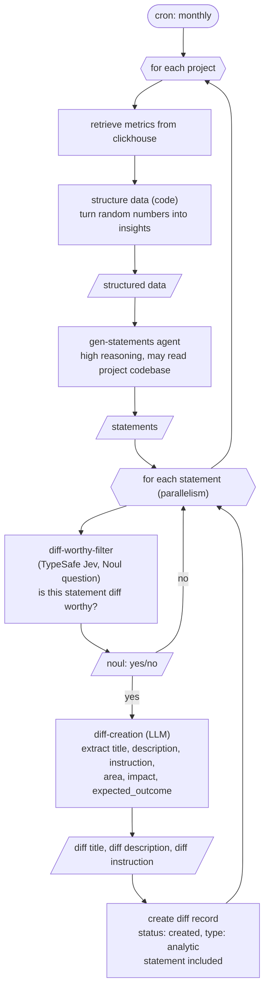

# DIFF CREATION FLOW: ANALYTICS



Side notes:

- Metrics come from clickhouse (ingestion: opentelemetry + signoz; mental model only, probably enforced on all projects created). Comparison is this month vs previous month:
  - page visits
  - time spent per page
  - clicks per button
  - blank (no-op) clicks per section
  - visit-to-click funnel conversion
  - performance: load time per page, api req time
- Structured data shape example:

```json
[
  {
    "metric": "purchase_button_clicks",
    "thisMonth": 44,
    "prevMonth": 50,
    "delta": -6
  },
  { "metric": "page_visits", "thisMonth": 470, "prevMonth": 400, "delta": 70 }
]
```

- structure data is deterministic code (query + compute deltas), not an LLM step.
- The diff record persists the originating statement (SCHEMAS: diffs.statement).
- Ingestion: the worker also runs a local ingest server (`pnpm --filter worker ingest`, `POST /ingest`) that validates events with zod and writes them to clickhouse using the project `ingest_token`; otel + signoz remain the production mental model. Dev data can also be seeded synthetically; the ClickHouse schema lives in `clickhouse/init.sql`.
- gen-statements currently reasons over the structured metrics only; reading the project codebase is a future refinement.
- gen-statements receives the structured data and returns statements shaped `{ category, statement, explanation }`, for example:

```json
[
  {
    "category": "conversion",
    "statement": "purchases went down 6 even though page visits went up 70",
    "explanation": "possible UX regression on the purchase flow"
  },
  {
    "category": "ux",
    "statement": "40 no-op clicks on the contact us page",
    "explanation": "broken link found in codebase, needs UI fix"
  }
]
```

Statements should be as specific as possible to give the instruction more context; point to specific parts of the code when possible.

- diff-worthy-filter is a TypeSafe Jev Noul question (one call per statement). It answers yes/no: is this statement diff worthy? The typed answer comes back directly, not text: nothing to parse. See https://docs.typesafe.ai/primitives/noul.
- Pitfall: what if the SDLC is already working on the project? Solved by sandboxed diff implementations, see sdlc-flow.md.
