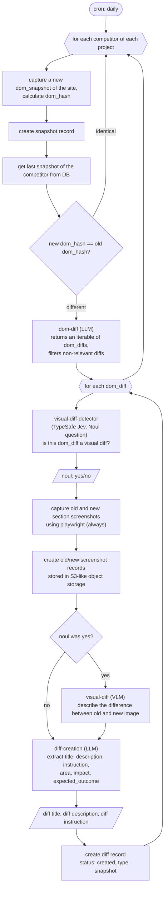

# DIFF CREATION FLOW: SNAPSHOTS

Side notes / open questions:

- The workflow takes an optional `{ projectIds?, mode? }` input. `mode: 'changes'` (default) is the daily cron flow above. `mode: 'gap'` runs at project creation when a `deployment_url` exists: capture our site + each competitor, LLM gap analysis (old = our site, new = competitor), then the same Noul/screenshot/VLM/diff-creation steps. `mode: 'init'` runs at project creation without a `deployment_url`: per competitor, capture the DOM, LLM writes a setup diff (`type: init`, one per competitor, `old_screenshot_id` null).

- Snapshot record is created before the comparison (kept). `get last snapshot` must exclude the just-created record (e.g. `WHERE id != new_snapshot.id ORDER BY created_at DESC`) so it cannot read itself.
- dom_diff shape: `{ selector, summary, old_text, new_text }`; the selector locates the changed section.
- Old screenshot: render the stored old dom_snapshot html in playwright and screenshot the selector. New screenshot: live page, same selector. Changed sections are unknown at capture time, so both are produced at diff time.
- Screenshots (old and new) are always captured, regardless of the Noul answer, and also serve as reference in the diff approval UI. The Noul answer only decides whether the VLM runs.
- identical dom_hash: continue with next competitor, or next project when last competitor is done.
- visual-diff-detector is a TypeSafe Jev Noul question (one call per dom_diff). It answers yes/no: is this dom_diff a visual diff? The typed answer comes back directly, not text: nothing to parse. On no, only the VLM step is skipped; screenshots and diff-creation always run. See https://docs.typesafe.ai/primitives/noul.
- Iteration order: dom_diffs -> competitors -> projects.
