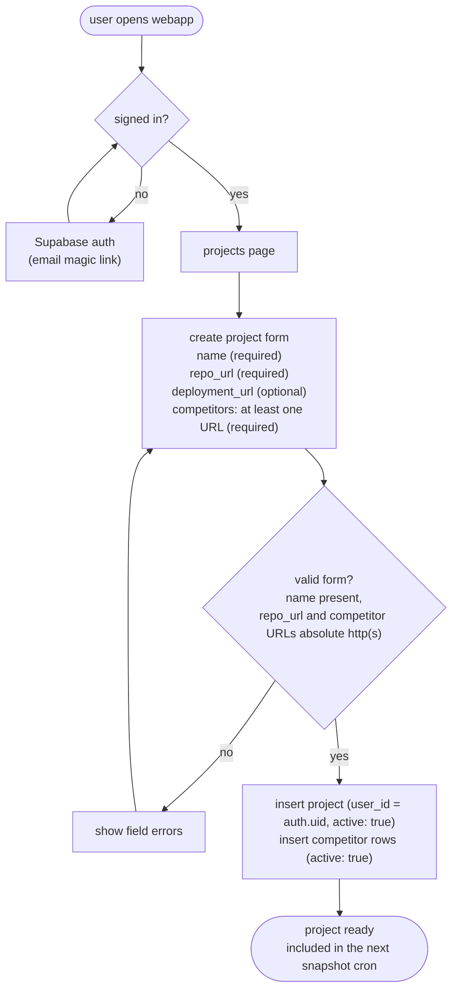

# PROJECT CREATION FLOW

Notes:
- At least one competitor URL is required at creation. Enforced in the app, not by the DB.
- `repo_url` is required now because the SDLC flow needs it. `deployment_url` is optional for now.
- Competitor URLs must be absolute `http(s)`.
- Editing a project (add/remove competitors) is out of scope for this iteration.
