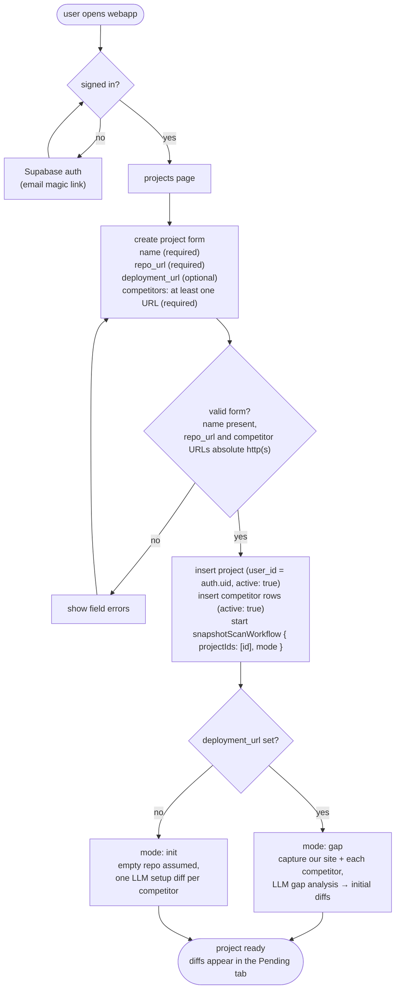

# PROJECT CREATION FLOW

Notes:
- At least one competitor URL is required at creation. Enforced in the app, not by the DB.
- `repo_url` is required because the SDLC flow needs it. `deployment_url` is optional.
- Competitor URLs must be absolute `http(s)`.
- The create action starts the existing `snapshotScanWorkflow` with `{ projectIds: [id], mode }`; mode is `gap` when `deployment_url` exists, otherwise `init`. The request does not block on captures or LLM calls.
- Init/gap diffs are ordinary diff rows: approval runs the existing `diffImplementationWorkflow` (no separate workflow).
- The repo is assumed empty when `deployment_url` is absent; emptiness is not verified for now.
- Without `deployment_url`, the project is still included in the daily snapshot cron (`changes` mode).
- Editing a project (add/remove competitors) is out of scope for this iteration.
