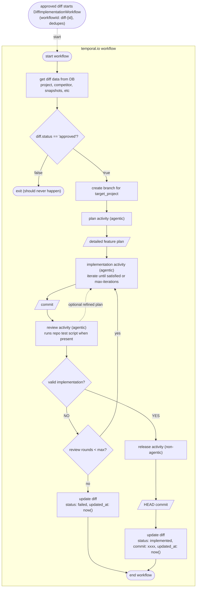

# TEMPORAL.IO WORKFLOW: DIFF IMPLEMENTATION

Side notes / Documentation:

Note on temporal.io activities:
They are fundamentally units of code that belong to an orchestration workflow, they may or may not use AI agents within them.

plan activity:
use an agent to read the codebase, understand the requirement through diff.title, diff.description and diff.instruction columns; return a detailed instruction for the implementation agent (inside implementation activity)

implementation activity:
use the received instruction to perform write operations in the given codebase, iterate the process until the agent is satisfied with the changes (or reached max-iterations limit), commit the changes and return commit information

review activity:
run git diff, understand what the changes mean, compare with the intention of the diff data (description, instruction), run tests (the repo test script when present), make sure all is sound and that the change is ready to production. return an optional refined plan for further iteration of the dev process.

release activity:
merge feature branch into main, push changes to production, return head of the version control.

Implementation loop:
`valid implementation == NO` retries the implementation activity; the optional refined plan from review feeds into that same retry. Two bounds: max-iterations inside the implementation activity, and review rounds (R) on the outer loop. Exhausting the outer cap sets status: failed and ends the workflow.

Setup limitation:
one diff implementation per project at a time. A sandbox environment per diff would allow multiple diffs at once, but that requires an extra MERGE step to combine different features into prod. Nice to have.

Not modeled:
Temporal start/dedupe semantics in detail (see workflowId), and the full status lifecycle (created -> approved/denied -> implemented/failed) across the other flows.
