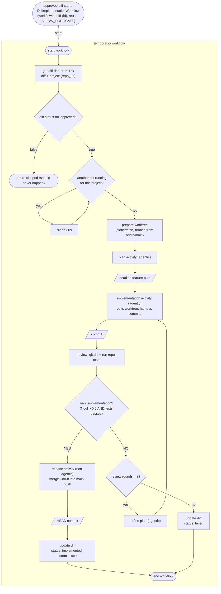

# TEMPORAL.IO WORKFLOW: DIFF IMPLEMENTATION

Side notes / Documentation:

Note on temporal.io activities:
They are fundamentally units of code that belong to an orchestration workflow, they may or may not use AI agents within them.

plan activity:
agent with read-only tools (Read, Glob, Grep) reads the codebase, understands the requirement through diff.title, diff.description and diff.instruction; returns a detailed plan for the implementation agent. Does not modify files.

implementation activity:
agent with edit tools (Read, Edit, Write, Bash, Glob, Grep) applies the plan in the worktree and stops; it is told not to run git commit. The harness commits the result after each round and returns the commit.

review activity:
non-agentic: collects `git diff origin/main...HEAD` and runs the repo test script (npm test when package.json has one; treated as passed/not-ran otherwise). The verdict is a TypeSafe Noul question over {request, git_diff, tests}: valid = Noul > 0.5 AND tests passed. On invalid, an agent produces a refined plan for the next round.

release activity:
merge the feature branch --no-ff into main, push to origin, return the HEAD commit.

Implementation loop:
`valid implementation == NO` feeds the refined plan back into the implementation activity. Bound: max 3 review rounds. Exhausting the cap sets status: failed and ends the workflow.

Per-project serialization:
before any work, the workflow waits (polling every 30s) while another diffImplementationWorkflow for the same project is Running. Check: list Running executions of the workflow type, parse diffId from each workflowId, compare project_id in the DB. Different projects run in parallel.

Failure handling:
unexpected activity errors are caught by the workflow, set status: failed, and rethrown. Max-rounds exhaustion also sets status: failed.

Workspace layout:
workspace/<projectId>/repo (clone) and workspace/<projectId>/worktrees/diff-<id> (per-diff sandbox), gitignored; WORKSPACE_DIR overrides the location. An empty remote raises a clear "repository has no commits" error.

Not modeled:
the full status lifecycle (created -> approved/denied -> implemented/failed) across the other flows; queue ack semantics beyond workflowId reuse.
