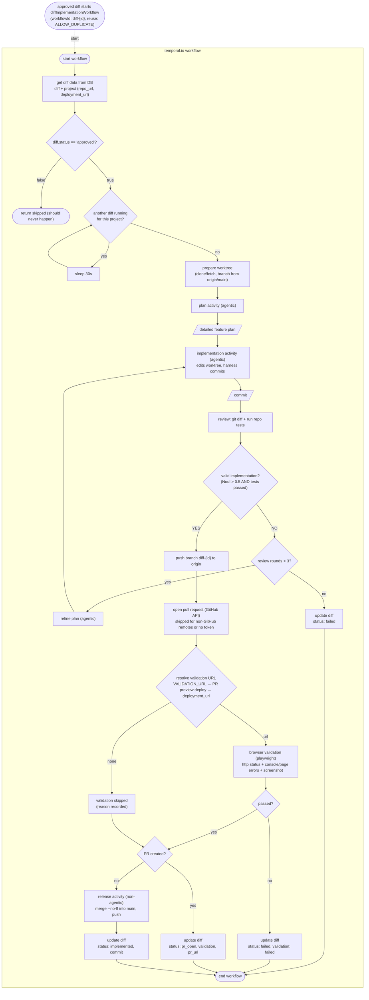

# TEMPORAL.IO WORKFLOW: DIFF IMPLEMENTATION

Side notes / Documentation:

Note on temporal.io activities:
They are fundamentally units of code that belong to an orchestration workflow, they may or may not use AI agents within them.

plan activity:
agent with read-only tools (Read, Glob, Grep) reads the codebase, understands the requirement through diff.title, diff.description, diff.instruction, diff.area, diff.impact and diff.expected_outcome; returns a detailed plan for the implementation agent. Does not modify files.

implementation activity:
agent with edit tools (Read, Edit, Write, Bash, Glob, Grep) applies the plan in the worktree and stops; it is told not to run git commit. The harness commits the result after each round and returns the commit.

review activity:
non-agentic: collects `git diff origin/main...HEAD` and runs the repo test script (npm test when package.json has one; treated as passed/not-ran otherwise). The verdict is a TypeSafe Noul question over {request, git_diff, tests}: valid = Noul > 0.5 AND tests passed. On invalid, an agent produces a refined plan for the next round.

release activities:
- push branch: `git push --force-with-lease origin diff-{id}` for every valid implementation.
- open pull request: GitHub REST API (`POST /repos/{owner}/{repo}/pulls`), reuse of an existing open PR on 422. Skipped when the remote is not github.com or `GITHUB_TOKEN` is missing; then the harness falls back to the release path below.
- release (degraded path): merge the feature branch --no-ff into main, push to origin, return the HEAD commit.
- browser validation: resolves a URL and loads it with playwright, recording HTTP status, console/page errors and a screenshot uploaded to storage. Failed when status >= 400, any page error, or more than 5 console errors.

Validation URL resolution order:
1. `VALIDATION_URL` env override (used in the local demo).
2. GitHub deployments preview for the pushed branch (`environment_url` of a successful deployment), polled every 15s for up to 20 attempts (5 minutes).
3. Project `deployment_url` on the last attempt.
4. Otherwise validation is recorded as `skipped` with a reason.

Ambiguity policy:
Noul answers are typed yes/no scores, never parsed text; the same threshold (`0.5`) is used by all detectors.

Status lifecycle on release:
- PR path: `pr_open` with `pr_url`, `validation_status` and `validation_notes`; a human merges the PR and the platform deploys it. Nothing is auto-merged to main, so no change reaches production without the PR review and validation record.
- Degraded path (non-GitHub remote): validated diff is merged to main and marked `implemented` with the resulting commit.
- Failed validation or exhausted review rounds: `failed` (PR left open for inspection when one exists).

Implementation loop:
`valid implementation == NO` feeds the refined plan back into the implementation activity. Bound: max 3 review rounds. Exhausting the cap sets status: failed and ends the workflow.

Per-project serialization:
before any work, the workflow waits (polling every 30s) while another diffImplementationWorkflow for the same project is Running. Check: list Running executions of the workflow type, parse diffId from each workflowId, compare project_id in the DB. Different projects run in parallel.

Failure handling:
unexpected activity errors are caught by the workflow, set status: failed, and rethrown. Max-rounds exhaustion and failed browser validation also set status: failed.

Workspace layout:
workspace/<projectId>/repo (clone) and workspace/<projectId>/worktrees/diff-<id> (per-diff sandbox), gitignored; WORKSPACE_DIR overrides the location. An empty remote raises a clear "repository has no commits" error.

Not modeled:
deployment of a merged PR (owned by the hosting platform), post-deploy health checks and automatic revert; the analytics diff creation flows (see diff-creation-with-*.md).
