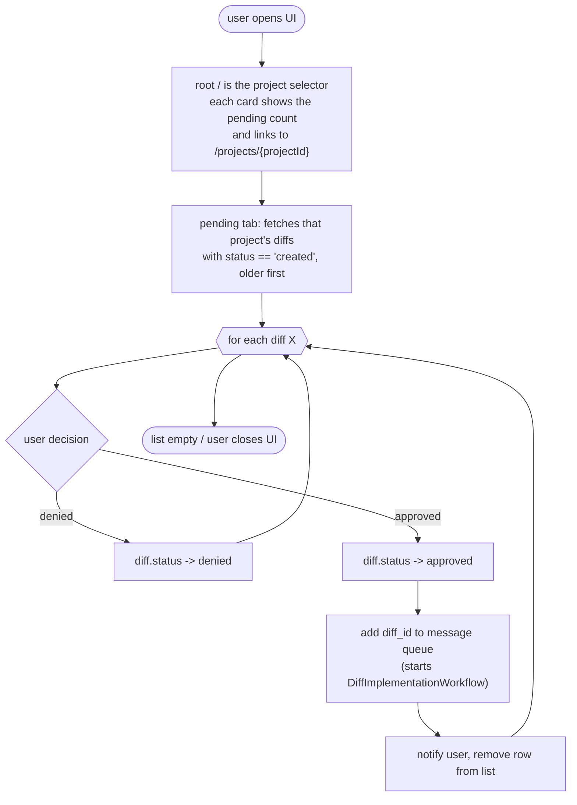

# UI APPROVAL FLOW

Notes:
- Root `/` is the project selector; each project card links to its project page and shows a pending-count badge.
- The project page has tabs: Pending (created), Decided (approved/denied), Shipped (pr_open/implemented/failed). Approve/deny only on Pending; shipped cards link to the pull request when present, otherwise to the commit on the project repo, and show the validation status badge.
- Each card shows the Change Intelligence layout: area, impact, proposed change, analytics evidence (statement), expected outcome, old/new screenshots and the agent instruction.
- Both rows (denied and approved) leave the Pending list immediately; a refetch also drops them because the pending fetch filters `status == 'created'`.
- "message queue" is fulfilled by Temporal: approval starts `DiffImplementationWorkflow` with `workflowId: diff-{id}` (dedupe; see sdlc-flow.md).
