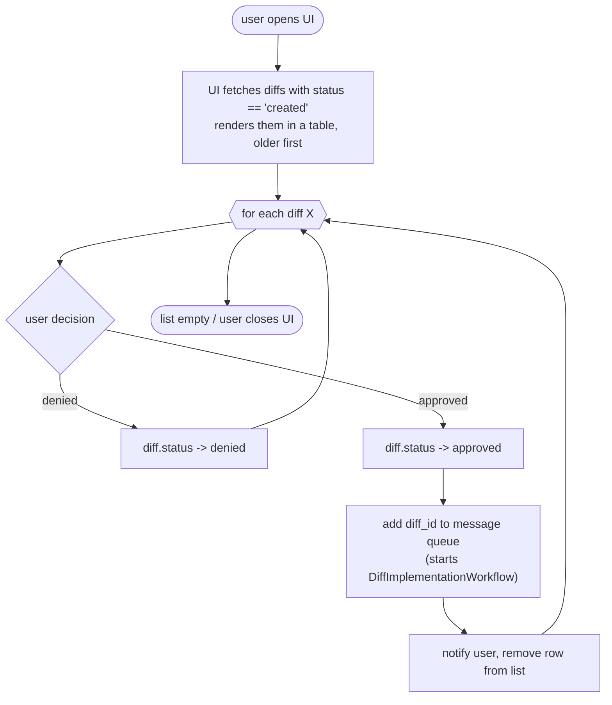

# UI APPROVAL FLOW

Notes:
- Both rows (denied and approved) leave the list immediately; a refetch also drops them because the fetch filters `status == 'created'`.
- "message queue" is fulfilled by Temporal: approval starts `DiffImplementationWorkflow` with `workflowId: diff-{id}` (dedupe; see sdlc-flow.md).
